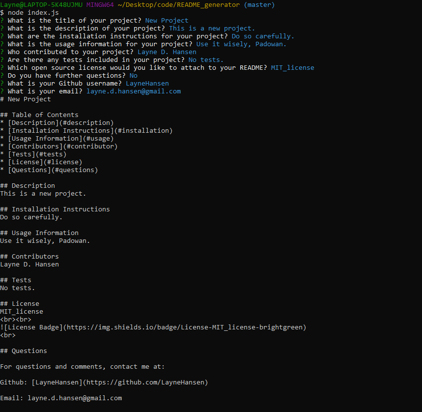
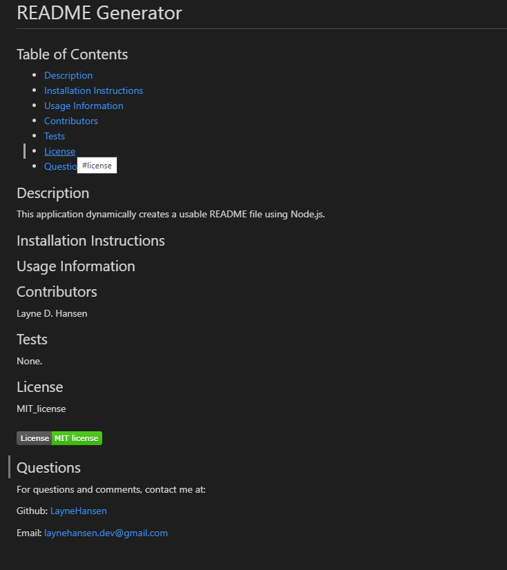

# README Generator

## Table of Contents
* [Images](#images)
* [Description](#description)
* [Installation Instructions](#installation)
* [Usage Information](#usage)
* [Contributors](#contributor)
* [Tests](#tests)
* [License](#license)
* [Questions](#questions)

## Images

Node View:

Final Product:

## Description
This application dynamically creates a usable README file using Node.js.

## Installation Instructions

## Usage Information

## Contributors
Layne D. Hansen

## Tests 
None.

## License
MIT_license
  

 

## Questions

For questions and comments, contact me at:

Github: [LayneHansen](https://github.com/LayneHansen)

Email: laynehansen.dev@gmail.com
    
  